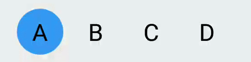
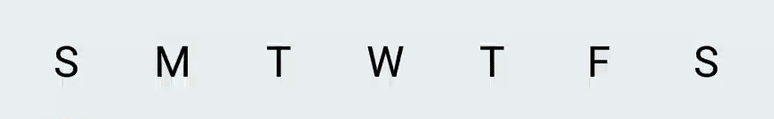
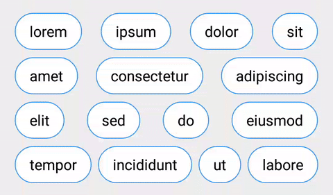
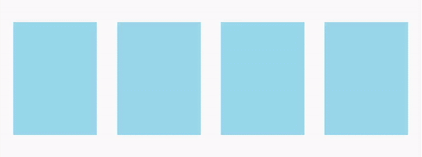

# ToggleButtonGroup

[](https://android-arsenal.com/api?level=15) [](https://android-arsenal.com/details/1/4885)

A container of toggle buttons, supports multiple / single selection and button customization.


## Gradle

AndroidX:

```
dependencies {
    implementation 'com.nex3z:toggle-button-group:1.2.3'
}
```

AppCompact:

```
dependencies {
    implementation 'com.nex3z:toggle-button-group:1.1.9'
}
```


## SingleSelectToggleGroup

<div align="center">
  
</div>

You can create a group of single-select toggle buttons with `SingleSelectToggleGroup`.

```xml
<com.nex3z.togglebuttongroup.SingleSelectToggleGroup
    android:id="@+id/group_choices"
    android:layout_width="match_parent"
    android:layout_height="wrap_content"
    app:tbgCheckedButton="@+id/choice_a">

    <com.nex3z.togglebuttongroup.button.CircularToggle
        android:id="@+id/choice_a"
        android:layout_width="wrap_content"
        android:layout_height="wrap_content"
        android:text="A"/>

    <com.nex3z.togglebuttongroup.button.CircularToggle
        android:id="@+id/choice_b"
        android:layout_width="wrap_content"
        android:layout_height="wrap_content"
        android:text="B"/>

       <!--...-->

</com.nex3z.togglebuttongroup.SingleSelectToggleGroup>
 ```


## MultiSelectToggleGroup

<div align="center">
  
</div>

You can create a group of multi-select toggle buttons with `MultiSelectToggleGroup`.

```xml
<com.nex3z.togglebuttongroup.MultiSelectToggleGroup
    android:id="@+id/group_weekdays"
    android:layout_width="match_parent"
    android:layout_height="wrap_content"
    app:tbgChildSpacing="auto">

    <com.nex3z.togglebuttongroup.button.CircularToggle
        android:id="@+id/sun"
        android:layout_width="wrap_content"
        android:layout_height="wrap_content"
        android:text="S"/>

    <com.nex3z.togglebuttongroup.button.CircularToggle
        android:id="@+id/mon"
        android:layout_width="wrap_content"
        android:layout_height="wrap_content"
        android:text="M"/>

    <!--...-->

</com.nex3z.togglebuttongroup.MultiSelectToggleGroup>
```


## Flow Buttons to Next Row

<div align="center">
  
</div>

```xml
<com.nex3z.togglebuttongroup.MultiSelectToggleGroup
    android:id="@+id/group_dummy"
    android:layout_width="match_parent"
    android:layout_height="wrap_content"
    android:layout_marginTop="16dp"
    app:tbgFlow="true"
    app:tbgChildSpacing="auto"
    app:tbgChildSpacingForLastRow="align"
    app:tbgRowSpacing="8dp">

    <!--...-->

</com.nex3z.togglebuttongroup.MultiSelectToggleGroup>
```

With `tbgFlow` attribute set to `true`, buttons are allowed to flow to next row when there is no enough space in current row. With `tbgChildSpacing` set to `auto`, buttons are evenly placed in each row.


## Listeners

For `SingleSelectToggleGroup`, use `OnCheckedChangeListener` to listen to the change of the checked button. Use `getCheckedId()` to get the id of the checked button.

```java
SingleSelectToggleGroup single = (SingleSelectToggleGroup) findViewById(R.id.group_choices);
single.setOnCheckedChangeListener(new SingleSelectToggleGroup.OnCheckedChangeListener() {
    @Override
    public void onCheckedChanged(SingleSelectToggleGroup group, int checkedId) {

    }
});
```

For `MultiSelectToggleGroup`, use `OnCheckedStateChangeListener` to be notified of any changes in the group. Use `getCheckedIds()` to get the ids of all checked buttons.

```java
MultiSelectToggleGroup multi = (MultiSelectToggleGroup) findViewById(R.id.group_weekdays);
multi.setOnCheckedChangeListener(new MultiSelectToggleGroup.OnCheckedStateChangeListener() {
    @Override
    public void onCheckedStateChanged(MultiSelectToggleGroup group, int checkedId, boolean isChecked) {

    }
});
```

## Custom Button

<div align="center">
  
</div>

You can implement custom toggle button in three ways,

- Extend [`CompoundButton`][CompoundButton] class

[`CompoundButton`][CompoundButton] implements [`Checkable`][Checkable] interface, toggles itself when being clicked and provides listener for [`ToggleButtonGroup`][ToggleButtonGroup] to keep track of its checked state. [`CompoundButton`][CompoundButton] is basically a [`Button`][Button] / [`TextView`][TextView]. You can add your custom style and behaviour to the button like [`CustomCompoundButton`][CustomCompoundButton] from the sample.

- or, implement [`ToggleButton`][ToggleButton] interface

If you choose to implement [`ToggleButton`][ToggleButton], besides the [`Checkable`][Checkable] interface, you also need to implement a `setOnCheckedChangeListener()`, which allows [`ToggleButtonGroup`][ToggleButtonGroup] to listen to the changes of any checked states. You need to handle the click event on the button and toggle its checked state properly, as [`ToggleButtonGroup`][ToggleButtonGroup] will not toggle the button when it's being clicked. [`CustomToggleButton`][CustomToggleButton] from the sample is a simple toggle button implementing [`ToggleButton`][ToggleButton].

- or, extend [`CompoundToggleButton`][CompoundToggleButton] class.

[`CompoundToggleButton`][CompoundToggleButton] implements [`ToggleButton`][ToggleButton] and toggles its checked state when being clicked. All you need to do is to design the look and feel for the checked and unchecked state. [`CustomCompoundToggleButton`][CustomCompoundToggleButton] from the sample extends [`CompoundToggleButton`][CompoundToggleButton] and uses a flipping animation for state transition as shown above.

For more detail, please check the [sample].


## Licence

```
Copyright 2018 nex3z

Licensed under the Apache License, Version 2.0 (the "License");
you may not use this file except in compliance with the License.
You may obtain a copy of the License at

   http://www.apache.org/licenses/LICENSE-2.0

Unless required by applicable law or agreed to in writing, software
distributed under the License is distributed on an "AS IS" BASIS,
WITHOUT WARRANTIES OR CONDITIONS OF ANY KIND, either express or implied.
See the License for the specific language governing permissions and
limitations under the License.
```


[CompoundButton]: https://developer.android.com/reference/android/widget/CompoundButton.html
[ToggleButtonGroup]: https://github.com/nex3z/ToggleButtonGroup/blob/master/togglebuttongroup/src/main/java/com/nex3z/togglebuttongroup/ToggleButtonGroup.java
[Button]: https://developer.android.com/reference/android/widget/Button.html
[TextView]: https://developer.android.com/reference/android/widget/TextView.html
[CustomCompoundButton]: https://github.com/nex3z/ToggleButtonGroup/blob/master/sample/src/main/java/com/nex3z/togglebuttongroup/sample/button/CustomCompoundButton.java
[ToggleButton]: https://github.com/nex3z/ToggleButtonGroup/blob/master/togglebuttongroup/src/main/java/com/nex3z/togglebuttongroup/button/ToggleButton.java
[CustomToggleButton]: https://github.com/nex3z/ToggleButtonGroup/blob/master/sample/src/main/java/com/nex3z/togglebuttongroup/sample/button/CustomToggleButton.java
[CompoundToggleButton]: https://github.com/nex3z/ToggleButtonGroup/blob/master/togglebuttongroup/src/main/java/com/nex3z/togglebuttongroup/button/CompoundToggleButton.java
[CustomCompoundToggleButton]: https://github.com/nex3z/ToggleButtonGroup/blob/master/sample/src/main/java/com/nex3z/togglebuttongroup/sample/button/CustomCompoundToggleButton.java
[Checkable]: https://developer.android.com/reference/android/widget/Checkable.html
[sample]: https://github.com/nex3z/ToggleButtonGroup/tree/master/sample/src/main/java/com/nex3z/togglebuttongroup/sample
